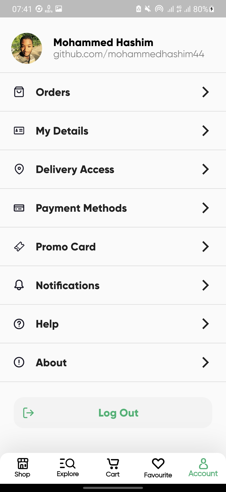

Flutter Grocery App

-------------  
### To try the app download the apk from the [Release Tab](https://github.com/mosamuhana/grocery_app/resources/releases/app-release.apk)  
-------------
  
#### Flutter Version Used : 1.22.4  
#### Desing Credit : By  [Mousa Mhanna](https://www.linkedin.com/in/mousa-mhanna-9100b21b8/)
#### Desing Files on Figma : [Online Groceries App UI](https://www.figma.com/community/file/882645007956337261)  
  
-------------  

## Screenshots  

  
   
  
  
   
  
  
   
  
  
  
  
  

-------------  

## Pages  
- Splash Page  
- Welcome Page  
- Home Page(Shop)  
- Product Details Page  
- Categories Page (Explore)  
- Products Page (After clicking any category)
- Filter Page  
- My Cart Page  
- Checkout Bottom Sheet  
- Order Failed Dialog  
- Order Accepted Page  
- Profile Page
